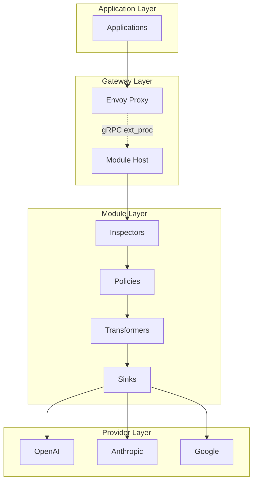

# System Patterns: Leash Security Gateway

## Architecture Patterns

### 1. Proxy + Sidecar Pattern
- **Envoy Proxy**: Handles HTTP traffic, routing, and load balancing
- **Module Host**: Processes requests through policy pipeline via gRPC
- **Separation of Concerns**: Network handling vs. business logic

### 2. Plugin Architecture
- **Module Types**: Inspectors, Policies, Transformers, Sinks
- **Dynamic Loading**: Hot-reload modules without gateway restart
- **Execution Pipeline**: Sequential processing with fail-fast semantics

### 3. Configuration-Driven Routing
- **Path-Based Routing**: `/v1/openai/*` → `api.openai.com/v1/*`
- **Provider Detection**: Extract provider from URL path
- **Minimal Integration**: Only base URL change required

## Key Design Decisions

### Data Plane Architecture
**Decision**: Use Envoy proxy with ext_proc filter  
**Rationale**: 
- Production-proven at scale
- Rich HTTP processing capabilities
- Native gRPC integration for module communication
- Observability and metrics built-in

**Alternative Considered**: Custom Go HTTP proxy  
**Why Rejected**: Would require rebuilding Envoy's capabilities

### Module Communication Protocol
**Decision**: gRPC with protobuf schemas  
**Rationale**:
- Type-safe communication
- Streaming support for real-time processing
- Language-agnostic module development
- Built-in health checking and load balancing

**Alternative Considered**: HTTP REST API  
**Why Rejected**: Less efficient for high-frequency communication

### Module Execution Model
**Decision**: Pipeline with typed phases  
**Rationale**:
- Clear separation of concerns (inspect → policy → transform → sink)
- Predictable execution order
- Failure isolation (inspectors fail-open, policies fail-closed)

## Component Relationships



## Data Flow Patterns

### Request Processing Flow
1. **HTTP Request** → Envoy receives on `/v1/{provider}/*`
2. **Provider Detection** → Extract provider from URL path
3. **Module Processing** → Send to gRPC Module Host
4. **Policy Pipeline** → Inspectors → Policies → Transformers → Sinks
5. **Provider Forwarding** → Route to actual provider endpoint
6. **Response Processing** → Apply response modules and return

### Module Chain Pattern
```
Request → [Inspector₁, Inspector₂, ...] → Policy₁ → Policy₂ → ... → Transformer₁ → ... → [Sink₁, Sink₂, ...]
```

**Execution Rules**:
- **Inspectors**: Run in parallel, failures are logged but don't block
- **Policies**: Run sequentially, first failure blocks request
- **Transformers**: Run sequentially, modify request/response
- **Sinks**: Run asynchronously, failures are retried

### Error Handling Patterns

#### Fail-Fast for Security (Policies)
```go
for _, policy := range policies {
    result, err := policy.ProcessRequest(req)
    if err != nil || result.Action == BLOCK {
        return BLOCK, err  // Immediate failure
    }
}
```

#### Fail-Open for Observability (Inspectors)
```go
for _, inspector := range inspectors {
    result, err := inspector.ProcessRequest(req)
    if err != nil {
        log.Warn("Inspector failed", err)
        continue  // Don't block request
    }
    mergeAnnotations(req, result.Annotations)
}
```

## State Management Patterns

### Stateless Processing
- **Modules**: No persistent state between requests
- **Configuration**: Loaded at startup, hot-reloaded on change
- **Tenant Isolation**: State separation through request context

### Caching Strategy
- **Response Caching**: Optional Redis-backed caching
- **Configuration Caching**: In-memory with TTL refresh
- **Provider Health**: Circuit breaker state per provider

## Concurrency Patterns

### Request Processing
- **Parallel Inspectors**: Use goroutines with WaitGroup
- **Sequential Policies**: Single-threaded execution
- **Async Sinks**: Fire-and-forget with retry queues

### Module Management
- **Hot Reload**: Blue-green deployment pattern
- **Health Checking**: Periodic gRPC health probes
- **Resource Limits**: Per-module memory and CPU constraints

## Security Patterns

### Defense in Depth
1. **Network Layer**: mTLS between components
2. **Application Layer**: API key validation and tenant isolation
3. **Module Layer**: Sandboxing and resource limits
4. **Data Layer**: Field-level encryption and redaction

### Fail-Closed Security
- **Policy Failures**: Block request on any policy error
- **Module Crashes**: Return 503 if critical modules unavailable
- **Configuration Errors**: Reject invalid configurations

## Observability Patterns

### Three Pillars Integration
- **Metrics**: Prometheus with custom business metrics
- **Logs**: Structured JSON with correlation IDs
- **Traces**: OpenTelemetry spans across module chain

### Correlation Strategy
```
Request ID → Trace ID → Span per Module → Logs with Context
```

## Deployment Patterns

### Self-Hosted Pattern
- **Single Tenant**: One gateway instance per organization
- **Infrastructure Control**: Customer manages deployment
- **Data Sovereignty**: All data stays in customer environment

### SaaS Pattern  
- **Multi-Tenant**: Shared infrastructure with tenant isolation
- **Managed Service**: Leash manages deployment and updates
- **Tenant Separation**: Database-level and configuration-level isolation

## Configuration Patterns

### Hierarchical Configuration
```yaml
global: {...}          # System-wide settings
tenant: {...}          # Tenant-specific overrides
module: {...}          # Module-specific configuration
```

### Hot Reload Pattern
1. **File Watcher** → Detect configuration changes
2. **Validation** → Schema and dependency validation
3. **Blue-Green** → Load new config alongside old
4. **Atomic Switch** → Switch traffic to new configuration
5. **Cleanup** → Remove old configuration
