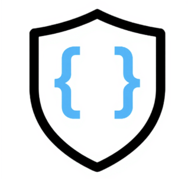

# Leash Security Gateway




An open-source LLM security gateway built with Envoy proxy and a pluggable module system. Provides centralized governance, observability, and policy enforcement for LLM traffic through configuration-based routing.

## 🎯 Key Features

- **Minimal Integration**: Applications only need to change base URL configuration
- **Multi-Provider Support**: OpenAI, Anthropic, Google, AWS Bedrock, and more
- **Pluggable Modules**: Extensible policy system for custom security requirements
- **Configuration-Based**: No code changes required, just URL routing
- **Production-Ready**: Comprehensive observability, security, and performance
- **Deployment Flexibility**: Self-hosted or SaaS deployment models

## 🚀 Quick Start

### Prerequisites

- Docker and Docker Compose
- Go 1.21+ (for development)
- Protocol Buffers compiler (for development)

### Development Setup (Docker Only)

```bash
# Clone the repository
git clone https://github.com/bendiamant/leash-gateway
cd leash-gateway

# Set up development environment
make dev-setup

# Start all services
make dev-up

# Test the gateway
make test-gateway
```

### Demo Application (✅ FULLY WORKING)

Try our fully functional demo app showcasing the gateway's capabilities:

```bash
# Navigate to the demo app
cd leash-demo-app

# Install dependencies
npm install

# Copy environment template and add your API keys
cp env.example .env.local
# Edit .env.local with your actual API keys

# Start the gateway services (in a separate terminal)
docker-compose -f docker-compose.gateway.yaml up -d

# Start the demo app
npm run dev
```

Open http://localhost:3002 (or port 3000) to explore:
- ✅ **Multi-provider chat interface** (OpenAI, Anthropic, Google) with AI SDK v5
- ✅ **Real-time streaming** with proper `useChat` hook implementation
- ✅ **Metrics dashboard** with Recharts visualization
- ✅ **Live health monitoring** for gateway and modules
- ✅ **Provider switching** without code changes
- ✅ **Dual chat implementations** for reliability

### Application Integration

Change your application's base URL configuration:

```python
# Before: Direct provider call
client = OpenAI(
    api_key="sk-...",
    base_url="https://api.openai.com/v1"
)

# After: Route through gateway (one line change)
client = OpenAI(
    api_key="sk-...",
    base_url="https://gateway.company.com/v1/openai"
)

# Application code remains identical
response = client.chat.completions.create(
    model="gpt-4o-mini",
    messages=[{"role": "user", "content": "Hello world"}]
)
```


### URL Routing Structure

```
gateway.company.com/v1/openai/*     → api.openai.com/v1/*
gateway.company.com/v1/anthropic/*  → api.anthropic.com/v1/*
gateway.company.com/v1/google/*     → generativelanguage.googleapis.com/v1/*
```

## 🏗️ Architecture

### High-Level Overview

```
Applications → Envoy Proxy → Module Host → LLM Providers
                    ↓             ↓
              Path-based      Policy Pipeline
               Routing       (Inspect → Policy → 
                            Transform → Sink)
```

### Components

- **Envoy Proxy**: Data plane handling HTTP traffic with ext_proc filter
- **Module Host**: Go gRPC server processing requests through policy pipeline  
- **Configuration System**: YAML-based routing and policy configuration
- **Observability Stack**: Prometheus metrics, structured logging, tracing

## 📊 Monitoring

The gateway exposes metrics on multiple endpoints:

- `http://localhost:9090/metrics` - Module Host metrics
- `http://localhost:9901/stats` - Envoy proxy statistics
- `http://localhost:8081/health` - Module Host health
- `http://localhost:8080/health` - Gateway health

### Key Metrics

- Gateway latency (target: <4ms P50, <10ms P95)
- Request throughput and success rates
- Token usage and cost tracking
- Policy violation counts
- Provider health and circuit breaker status

## 🔧 Configuration

### Basic Configuration

```yaml
# configs/gateway/config.yaml
providers:
  openai:
    endpoint: "https://api.openai.com/v1"
    models: ["gpt-4o-mini", "gpt-4o"]
  anthropic:
    endpoint: "https://api.anthropic.com/v1"
    models: ["claude-3-sonnet-20240229"]

modules:
  rate-limiter:
    enabled: true
    config:
      default_limit: 1000
      default_window: "1h"
  
  logger:
    enabled: true
    config:
      destinations:
        - type: "stdout"
          format: "json"
```

### Multi-Tenant Configuration

```yaml
tenants:
  acme-corp:
    name: "Acme Corporation"
    policies: ["rate-limiter", "pii-detector", "cost-tracker"]
    quotas:
      requests_per_hour: 10000
      cost_limit_usd: 1000.00
    allowed_providers: ["openai", "anthropic"]
```

## 🛠️ Development

### Build from Source

```bash
# Install Go 1.21+ and Protocol Buffers compiler
# Then:

make install-tools  # Install development tools
make build         # Build binaries
make test          # Run tests
make lint          # Run linter
```

### Module Development

```bash
# Generate module template
make module-template NAME=my-policy

# Build and test module
cd modules/my-policy
go build -buildmode=plugin -o my-policy.so
```

### Docker Development

```bash
# Build images
make docker-build

# Start development environment
make dev-up

# View logs
make dev-logs

# Stop environment
make dev-down
```

## 📝 API Examples

### Testing with curl

```bash
# Test OpenAI routing
curl -X POST http://localhost:8080/v1/openai/chat/completions \
  -H "Authorization: Bearer sk-test" \
  -H "Content-Type: application/json" \
  -d '{"model": "gpt-4o-mini", "messages": [{"role": "user", "content": "test"}]}'

# Test Anthropic routing  
curl -X POST http://localhost:8080/v1/anthropic/messages \
  -H "x-api-key: ant-test" \
  -H "Content-Type: application/json" \
  -d '{"model": "claude-3-sonnet-20240229", "messages": [{"role": "user", "content": "test"}]}'
```

### Health Checks

```bash
# Gateway health
curl http://localhost:8080/health

# Module Host health
curl http://localhost:8081/health

# Envoy admin interface
curl http://localhost:9901/ready
```

## 🔒 Security

- **Fail-closed**: Policy failures block requests by default
- **Tenant isolation**: Multi-tenant data separation
- **Audit trails**: Complete request/response logging
- **Circuit breakers**: Provider failure protection
- **Rate limiting**: Per-tenant and global limits

## 📈 Performance

### Targets

- Gateway overhead: <4ms P50, <10ms P95
- Throughput: >1000 RPS sustained  
- Module processing: <2ms P95 per module
- Error rate: <0.1% under normal load

### Load Testing

```bash
# Install k6 and run load tests
make load-test
```

## 🤝 Contributing

1. Fork the repository
2. Create a feature branch
3. Make your changes
4. Add tests
5. Run `make lint test`
6. Submit a pull request

## 📄 License

Licensed under the Apache License, Version 2.0. See [LICENSE](LICENSE) for details.

## 🆘 Support

- **Documentation**: [docs/](docs/)
- **Issues**: [GitHub Issues](https://github.com/bendiamant/leash-gateway/issues)
- **Discussions**: [GitHub Discussions](https://github.com/bendiamant/leash-gateway/discussions)

## 🗺️ Roadmap

- **Phase 1** (Current): Core gateway with basic modules
- **Phase 2**: Advanced modules and streaming support
- **Phase 3**: Multi-provider ecosystem expansion
- **Phase 4**: Enterprise features and compliance

---

Built with ❤️ by the Leash Security team.
