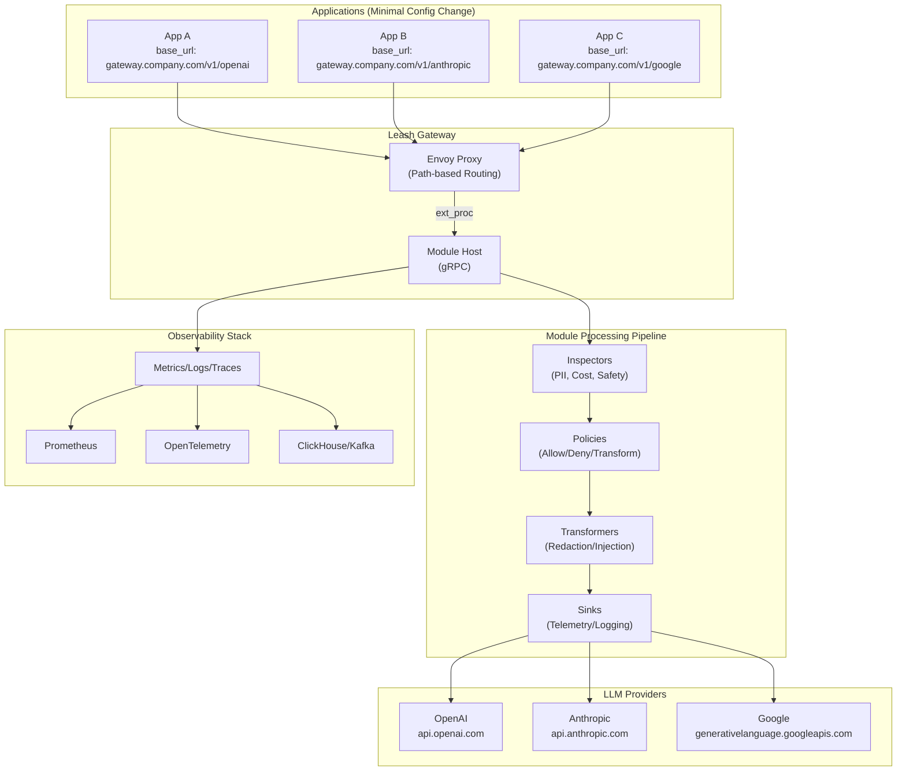
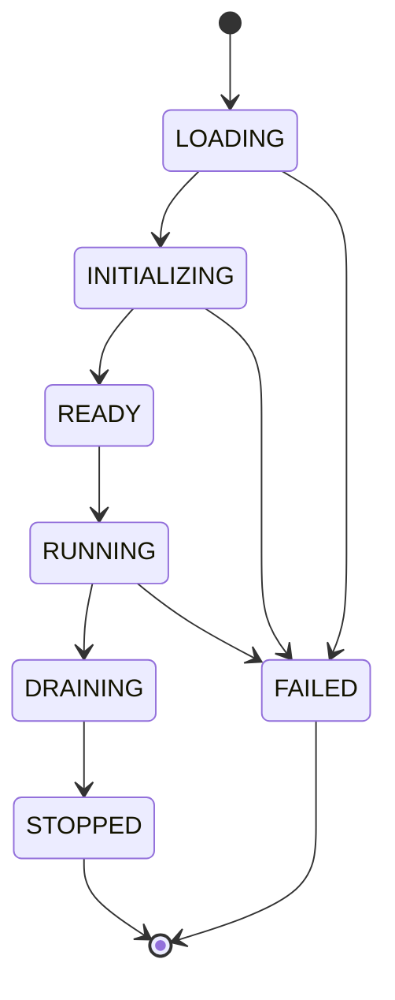

# Leash Security — Envoy‑based LLM Security Gateway (OSS)
## Tech Design v1.0

### 🎯 Goal

An Envoy‑based, OSS gateway that inspects and governs LLM requests through **configuration-based routing**, collects structured telemetry, and enforces pluggable policies. Applications route LLM traffic through the gateway by changing base URLs, enabling centralized governance without complex integrations.

**Deployment Models**: 
- **Self-hosted**: Enterprise deployment in customer infrastructure
- **SaaS**: Hosted multi-tenant service for faster adoption

**Key Insight**: Configuration-based routing (changing base URLs) provides the best balance of minimal integration effort and centralized control.

---

## 📋 TL;DR

- **Integration**: Applications change base URL from `api.openai.com` to `gateway.company.com/v1/openai`
- **Data plane**: Envoy proxy with HTTP filters (ext_proc) for request interception and processing
- **Module runtime**: gRPC Module Host loads policy modules (Inspectors, Policies, Transformers, Sinks) dynamically
- **Provider routing**: Path-based routing (`/v1/openai`, `/v1/anthropic`) to different LLM providers
- **Deployment modes**: Self-hosted (customer infrastructure) or SaaS (hosted service)
- **Optional SDKs**: Enhanced features for teams wanting rich functionality
- **OSS**: Apache‑2.0, modular architecture, pluggable components

---

## 🎯 Scope & Non‑Goals

### ✅ In Scope

- **Gateway Core**: Envoy-based proxy with configurable routing and policy enforcement
- **Configuration Integration**: Minimal changes (base URL update) for application integration
- **Policy Modules**: Pluggable modules for inspection, governance, transformation, and telemetry
- **Provider Support**: HTTP proxy to OpenAI, Anthropic, Google, AWS Bedrock, Cohere, etc.
- **Multi-deployment**: Same codebase for self-hosted and SaaS deployments
- **Optional SDKs**: Enhanced client libraries for teams wanting additional features
- **Observability**: Structured logging, metrics, and tracing for all LLM traffic

### ❌ Non‑Goals (v1.0)

- No application code rewriting requirements (beyond base URL configuration)
- No complex client-side integrations or mandatory SDK adoption
- No in‑gateway model inference (external services for ML-based detection)
- No protocol translation beyond HTTP proxy functionality

---

## 🚀 Deployment Modes

### **Self-Hosted Deployment**
- Deploy in customer's infrastructure (VPC, on-premise, private cloud)
- Customer maintains full control of data and configuration
- Single-tenant deployment with customer-specific policies

### **SaaS Deployment**  
- Multi-tenant hosted service
- Tenant isolation through configuration and data separation
- Managed infrastructure and updates

### **Integration Method**
- **Configuration-based routing**: Applications change base URL configuration
- **Minimal changes**: `https://api.openai.com/v1` → `https://gateway.company.com/v1/openai`
- **Works with any HTTP client**: No SDK requirement, existing code compatibility

---

## 🏗️ High‑Level Architecture

### **Configuration-Based Routing Architecture**



### **Request Flow**

1. **Application**: Makes HTTP request to `gateway.company.com/v1/openai/chat/completions`
2. **Envoy**: Routes based on path (`/v1/openai` → OpenAI provider)
3. **Module Host**: Processes request through policy pipeline
4. **Provider**: Forwards to actual LLM provider (`api.openai.com`)
5. **Response**: Returns through same pipeline with response processing

### **URL Routing Structure**

```
gateway.company.com/v1/openai/*     → api.openai.com/v1/*
gateway.company.com/v1/anthropic/*  → api.anthropic.com/v1/*
gateway.company.com/v1/google/*     → generativelanguage.googleapis.com/v1/*
gateway.company.com/v1/bedrock/*    → bedrock-runtime.{region}.amazonaws.com/*
```


---

## 📊 Data Model & Processing

### Request Processing Schema

```json
{
  "request_id": "req_2025091118351701",
  "timestamp": "2025-09-11T18:35:17Z",
  "tenant": "acme-corp",
  "source": {
    "service": "payments-api",
    "ip_address": "10.0.1.100",
    "user_agent": "python-requests/2.31.0",
    "headers": {
      "authorization": "Bearer sk-...[redacted]",
      "content-type": "application/json"
    }
  },
  "provider": {
    "name": "openai",
    "endpoint": "/v1/chat/completions",
    "detected_from": "url_path"
  },
  "llm_request": {
    "model": "gpt-4o-mini",
    "messages": [
      {"role": "system", "content": "You are a helpful assistant"},
      {"role": "user", "content": "Summarize this document..."}
    ],
    "parameters": {
      "temperature": 0.2,
      "max_tokens": 1024,
      "stream": false
    }
  },
  "raw_request": {
    "method": "POST",
    "path": "/v1/openai/chat/completions",
    "size_bytes": 1247,
    "body_hash": "sha256:abc123..."
  }
}
```

### Response Processing Schema

```json
{
  "request_id": "req_2025091118351701",
  "timestamp": "2025-09-11T18:35:17Z",
  "tenant": "acme-corp",
  "provider": {
    "name": "openai",
    "model_requested": "gpt-4o-mini",
    "model_used": "gpt-4o-mini-2024-07-18",
    "endpoint_called": "https://api.openai.com/v1/chat/completions"
  },
  "llm_response": {
    "status_code": 200,
    "choices": [{
      "message": {"role": "assistant", "content": "Here's a summary..."},
      "finish_reason": "stop",
      "index": 0
    }],
    "system_fingerprint": "fp_abc123"
  },
  "usage": {
    "tokens": {"prompt": 150, "completion": 75, "total": 225},
    "cost_usd": 0.004500,
    "cost_calculation": {
      "prompt_tokens": 150,
      "completion_tokens": 75,
      "prompt_rate_per_1k": 0.010,
      "completion_rate_per_1k": 0.030
    }
  },
  "performance": {
    "gateway_overhead_ms": 3.2,
    "provider_latency_ms": 1243.8,
    "total_latency_ms": 1247.0,
    "module_processing_ms": 2.1
  },
  "policy_results": {
    "inspections": [
      {"module": "pii-detector", "detected": ["email"], "confidence": 0.95},
      {"module": "cost-tracker", "estimated_cost": 0.004500}
    ],
    "policy_decisions": [
      {"module": "content-filter", "action": "allow", "reason": "content_safe"}
    ],
    "transformations": [],
    "final_action": "allow"
  }
}
```

### Multi-Tenant Data Isolation

```yaml
# Tenant-specific configuration
tenant_config:
  tenant_id: "acme-corp"
  policies:
    - content-filter
    - cost-limiter
    - pii-detector
  quotas:
    requests_per_hour: 10000
    cost_limit_usd: 1000.00
  providers:
    openai:
      api_key_ref: "secret/acme-corp/openai"
      models: ["gpt-4o-mini", "gpt-4o"]
    anthropic:
      api_key_ref: "secret/acme-corp/anthropic"
      models: ["claude-3-sonnet-20240229"]
```

### 🔒 Privacy Controls

- **Field‑level redaction**: Configurable field masking
- **Hashing**: SHA-256 content fingerprinting  
- **TTL policies**: Automatic data expiration

---

## 🔄 Request Flow

### 💻 Application Integration

**Before (Direct Provider Call)**:
```python
# Application makes direct call to provider
client = OpenAI(
    api_key="sk-...",
    base_url="https://api.openai.com/v1"  # Direct to provider
)
```

**After (Gateway Routing)**:
```python
# Application routes through gateway (minimal change)
client = OpenAI(
    api_key="sk-...",
    base_url="https://gateway.company.com/v1/openai"  # Through gateway
)
```

### 🏠 Gateway Processing Pipeline

1. **Request Interception**: Envoy receives HTTP request on path `/v1/{provider}/*`
2. **Provider Detection**: Extract provider from URL path (`/v1/openai` → OpenAI)
3. **Module Processing**: Send to gRPC Module Host for policy evaluation
4. **Policy Pipeline**: Inspectors → Policies → Transformers → Sinks
5. **Provider Forwarding**: Proxy request to actual provider endpoint
6. **Response Processing**: Apply response modules and return to application

### 🔍 Module Processing Detail

```
HTTP Request → Envoy → ext_proc → Module Host (gRPC)
                                        │
                                        v
                                   ┌────────────┐
                                   │ Inspectors │ → Analyze content, detect PII, estimate cost
                                   └────────────┘
                                        │
                                        v
                                   ┌────────────┐
                                   │  Policies   │ → Allow/deny/transform decisions
                                   └────────────┘
                                        │
                                        v
                                   ┌────────────┐
                                   │Transformers│ → Redact PII, inject context
                                   └────────────┘
                                        │
                                        v
                                   ┌────────────┐
                                   │   Sinks    │ → Log to observability systems
                                   └────────────┘
                                        │
                                        v
                              Forward to Provider
```

### 🌊 Streaming Support

1. **Request Processing**: Full request analyzed before streaming begins
2. **Stream Establishment**: Proxy streaming connection to provider
3. **Chunk Analysis**: Optional real-time processing of response chunks
4. **Stream Termination**: Ability to terminate stream on policy violations
5. **Response Logging**: Complete request/response logged after stream ends

### 🚫 Error Handling

- **Module Failures**: Continue processing, log errors (fail-open for non-critical)
- **Policy Failures**: Block request (fail-closed for security)
- **Provider Failures**: Return error to application (no automatic fallbacks)
- **Gateway Failures**: Application falls back to direct provider calls

---

## ⚙️ Envoy Configuration (Reverse Proxy)

### HTTP Filters

```yaml
http_filters:
  # Rate limiting
  - name: envoy.filters.http.local_ratelimit
    typed_config:
      "@type": type.googleapis.com/envoy.extensions.filters.http.local_ratelimit.v3.LocalRateLimit
      stat_prefix: llm_gateway_rate_limit
      token_bucket:
        max_tokens: 1000
        tokens_per_fill: 100
        fill_interval: 1s
      filter_enabled:
        default_value:
          numerator: 100
          denominator: HUNDRED

  # External processing (module host)
  - name: envoy.filters.http.ext_proc
    typed_config:
      "@type": type.googleapis.com/envoy.extensions.filters.http.ext_proc.v3.ExternalProcessor
      grpc_service:
        envoy_grpc:
          cluster_name: module_host
        timeout: 2s
      processing_mode:
        request_body_mode: BUFFERED
        response_body_mode: STREAMED  # For streaming support
        request_header_mode: SEND
        response_header_mode: SEND
      message_timeout: 2s
      failure_mode_allow: false  # Fail closed
      max_message_timeout: 10s

  - name: envoy.filters.http.router
```

### Clusters

```yaml
clusters:
  - name: module_host
    connect_timeout: 1s
    type: STRICT_DNS
    load_assignment:
      cluster_name: module_host
      endpoints:
        - lb_endpoints:
            - endpoint:
                address:
                  socket_address:
                    address: module_host
                    port_value: 50051
    health_checks:
      - timeout: 1s
        interval: 5s
        grpc_health_check:
          service_name: "leash.ModuleHost"
    circuit_breakers:
      thresholds:
        - max_connections: 100
          max_requests: 1000
          max_retries: 3
```


---

## 🧩 Module System

### Module Types

| Type | Purpose | Examples | Input |
|------|---------|----------|-------|
| 🔍 **Inspector** | Analyze HTTP request/response | PII detection, jailbreak detection, cost analysis | HTTP Request + Body |
| 🛡️ **Policy** | Enforce governance rules | Allow/deny/warn decisions, quotas, rate limiting | HTTP Request + Inspector Results |
| 🔧 **Transformer** | Modify request/response | Redact PII, inject headers, content filtering | HTTP Request/Response |
| 📡 **Sink** | Export telemetry data | Structured logging, metrics, analytics | Complete Request/Response Context |

### Execution Phases

- **Request Processing**: `inspect_request` → `evaluate_policies` → `transform_request` → `log_request`
- **Response Processing**: `inspect_response` → `transform_response` → `log_response`
- **Actions**: `CONTINUE`, `TRANSFORM`, `BLOCK`, `ANNOTATE`

### Module Implementation

- 🟢 **Go Modules**: Native gRPC services, hot reload capability
- 🦀 **Plugin System**: Dynamic loading of compiled modules
- 🔧 **Configuration**: YAML-based module configuration and routing

### gRPC Interface (Enhanced)

```protobuf
service Module {
  // Lifecycle management
  rpc Initialize(InitializeRequest) returns (InitializeResponse);
  rpc Healthcheck(HealthcheckRequest) returns (HealthcheckResponse);
  rpc Shutdown(ShutdownRequest) returns (ShutdownResponse);
  rpc GetMetadata(GetMetadataRequest) returns (ModuleMetadata);
  
  // Request processing
  rpc OnRequestHeaders(RequestHeadersContext) returns (HeaderAction);
  rpc OnRequestBody(RequestBodyContext) returns (BodyAction);
  rpc OnRequestComplete(RequestCompleteContext) returns (Action);
  
  // Response processing (streaming support)
  rpc OnResponseHeaders(ResponseHeadersContext) returns (HeaderAction);
  rpc OnResponseChunk(ResponseChunkContext) returns (ChunkAction);
  rpc OnResponseComplete(ResponseCompleteContext) returns (Action);
  
  // Configuration hot-reload
  rpc UpdateConfig(UpdateConfigRequest) returns (UpdateConfigResponse);
  rpc ValidateConfig(ValidateConfigRequest) returns (ValidateConfigResponse);
}
```

#### Enhanced Action Types

```protobuf
enum ActionKind {
  CONTINUE = 0;
  BLOCK = 1;
  TRANSFORM = 2;
  ANNOTATE = 3;
  RETRY = 4;     // New: Retry with backoff
  ROUTE = 5;     // New: Route to different provider
  CACHE = 6;     // New: Return cached response
}
```

#### Streaming Support

```protobuf
message ChunkAction {
  ActionKind kind = 1;
  bytes transformed_data = 2;
  bool terminate_stream = 3;  // Stop stream mid-response
  repeated Annotation annotations = 4;
}
```


---

## 🔌 Provider Routing & HTTP Proxy

### 🗺️ Path-Based Provider Routing

**URL Structure**:
```
gateway.company.com/v1/openai/*     → api.openai.com/v1/*
gateway.company.com/v1/anthropic/*  → api.anthropic.com/v1/*
gateway.company.com/v1/google/*     → generativelanguage.googleapis.com/v1/*
gateway.company.com/v1/bedrock/*    → bedrock-runtime.{region}.amazonaws.com/*
```

**Envoy Route Configuration**:
```yaml
route_config:
  name: llm_gateway_routes
  virtual_hosts:
  - name: llm_providers
    domains: ["*"]
    routes:
    - match:
        prefix: "/v1/openai/"
      route:
        cluster: openai_cluster
        prefix_rewrite: "/v1/"
    - match:
        prefix: "/v1/anthropic/"
      route:
        cluster: anthropic_cluster
        prefix_rewrite: "/v1/"
    - match:
        prefix: "/v1/google/"
      route:
        cluster: google_cluster
        prefix_rewrite: "/v1/"
```

### 🔄 HTTP Proxy Implementation

**Provider Cluster Configuration**:
```yaml
clusters:
- name: openai_cluster
  type: LOGICAL_DNS
  load_assignment:
    cluster_name: openai_cluster
    endpoints:
    - lb_endpoints:
      - endpoint:
          address:
            socket_address:
              address: api.openai.com
              port_value: 443
  transport_socket:
    name: envoy.transport_sockets.tls
    typed_config:
      "@type": type.googleapis.com/envoy.extensions.transport_sockets.tls.v3.UpstreamTlsContext
      sni: api.openai.com
```

### 🔧 Request/Response Processing

**Module Host gRPC Interface**:
```protobuf
service ModuleHost {
  rpc ProcessRequest(ProcessRequestRequest) returns (ProcessRequestResponse);
  rpc ProcessResponse(ProcessResponseRequest) returns (ProcessResponseResponse);
}

message ProcessRequestRequest {
  string request_id = 1;
  string tenant_id = 2;
  string provider = 3;  // Extracted from URL path
  HttpRequest http_request = 4;
  map<string, string> headers = 5;
  bytes body = 6;
}

message ProcessRequestResponse {
  Action action = 1;  // CONTINUE, BLOCK, TRANSFORM
  bytes modified_body = 2;  // If transformed
  map<string, string> additional_headers = 3;
  string block_reason = 4;  // If blocked
}
```

### 🔍 Optional SDK Enhancement

**For teams wanting rich features**:
```python
# Optional: Enhanced SDK with additional features
from leash_ai import LeashLLM

# SDK can provide fallbacks, caching, etc.
leash = LeashLLM(
    gateway_url="https://gateway.company.com",
    fallback_providers=["openai", "anthropic"],
    cache_enabled=True,
    retry_attempts=3
)

# Same OpenAI interface, enhanced reliability
response = leash.chat.completions.create(
    model="gpt-4o-mini",
    messages=[{"role": "user", "content": "Hello"}]
)
```

**SDK Features** (Optional):
- Automatic fallbacks between providers
- Client-side caching
- Retry logic with exponential backoff
- Request/response transformation
- Framework integrations (LangChain, etc.)

**Core Principle**: Gateway works with any HTTP client, SDK provides enhancements

---

## 🔐 Identity & Key Management

- **Inbound Authentication**: mTLS/JWT validation
- **Outbound Keys**: Provider keys from KMS, injected by policy
- **Key Stripping**: Strip inbound keys, re-inject approved credentials

---

## 📊 Observability

### Metrics
- **Request metrics**: Rate, latency, success/error rates
- **Business metrics**: Token counts, costs, safety scores
- **Module metrics**: Processing time, failure rates

### Tracing
- **OpenTelemetry spans**: End-to-end request tracing
- **Module chain visibility**: Per-module execution tracking

### Events & Sinks
- **ClickHouse**: Analytics and reporting
- **Kafka**: Real-time event streaming
- **OTLP**: OpenTelemetry Protocol export

---

## 🔒 Privacy & Compliance

### Data Protection
- **Configurable redaction**: Field-level masking before persistence
- **TTL policies**: Per-field data expiration
- **Encryption**: At-rest and in-transit

### Access Control
- **Tenant-scoped RBAC**: Multi-tenant isolation
- **Data residency tags**: Geographic data placement
- **Audit trails**: Complete request/response logging

⸻

## ⚡ Performance & SLI/SLO

### 🎯 Service Level Objectives

| Metric | Target | Measurement |
|--------|--------|--------------|
| Gateway Latency P50 | ≤4ms | Overhead only |
| Gateway Latency P95 | ≤10ms | Overhead only |
| Module Processing P95 | ≤2ms | Per module |
| Request Success Rate | ≥99.9% | Non-policy blocks |
| Module Availability | ≥99.95% | Health check based |
| Provider Success Rate | ≥99.5% | Excluding rate limits |

### 📊 Monitoring Stack

- **Metrics**: Prometheus with custom business metrics (cost, safety, policy decisions)
- **Tracing**: OpenTelemetry spans across module chain
- **Alerting**: Error budget burn rate alerts (fast: 14.4x, slow: 3x)
- **Dashboards**: Grafana with SLO compliance tracking

### 💪 Load Testing

- **Baseline**: 1000 RPS steady state
- **Peak**: 5000 RPS burst capacity
- **Streaming**: 10% of traffic, latency within SLO
- **Module Stress**: Heavy processing (PII, content filter, cost tracking)

### 📊 Performance Limits

- **Request Body**: 10MB max
- **Module Memory**: Configurable per module (default 256MB)
- **Module CPU**: Max 50% of container
- **Streaming**: Backpressure handling for slow modules

⸻

## 🛡️ Security Considerations

### 🚫 Fail-Safe Defaults
- **Fail-closed**: All policy failures block requests
- **Default deny**: Explicit allow rules required

### 🛡️ DoS Protection
- **Request limits**: 10MB max body size
- **Rate limiting**: 1000 RPS default
- **Circuit breakers**: Per-provider failure thresholds

### 📼 Module Sandboxing
- **Resource limits**: Memory, CPU, timeout enforcement
- **Crash isolation**: Module failures don't affect gateway
- **Signature verification**: Signed module binaries

### 🔐 Key Management
- **Provider keys**: Sourced from KMS
- **Key stripping**: Remove inbound credentials
- **Least privilege**: Minimal key injection

### 📝 Audit & Privacy
- **Complete audit trail**: Request/response logging with correlation IDs
- **Field-level redaction**: Configurable PII masking
- **Tenant isolation**: Multi-tenant data separation

### 🔒 Supply Chain Security
- **SBOM generation**: Software bill of materials
- **Signed releases**: Cryptographic signatures
- **Vulnerability scanning**: Automated security checks

### 🌐 Network Security
- **mTLS**: Inter-component encryption
- **Encryption at rest**: Data storage protection

### 📄 Compliance
- **SOC2**: Security controls framework
- **GDPR**: Data protection compliance
- **Audit log retention**: Configurable retention policies

---

## 🛠️ SDK Architecture & Framework Integration

### Multi-Language SDK Support

#### Python SDK Features
```python
from leash_ai import LeashLLM
from leash_ai.integrations import LangChainAdapter, CrewAIAdapter

# Direct usage
leash = LeashLLM(gateway_url="https://gateway.company.com")

# Framework integration
langchain_llm = LangChainAdapter(leash)
crewai_llm = CrewAIAdapter(leash)

# Configuration-driven provider selection
config = {
    "strategy": {"mode": "fallback"},
    "targets": [
        {"provider": "openai", "model": "gpt-4o-mini"},
        {"provider": "anthropic", "model": "claude-3-sonnet-20240229"}
    ]
}

response = leash.chat.completions.create(
    messages=[{"role": "user", "content": "Hello"}],
    config=config
)
```

#### TypeScript SDK Features
```typescript
import { LeashLLM } from '@leash-security/sdk'
import { createOpenAI } from 'ai'  // Vercel AI SDK integration

// Direct usage
const leash = new LeashLLM({
  gatewayUrl: 'https://gateway.company.com',
  apiKey: process.env.LEASH_API_KEY
})

// Vercel AI SDK integration
const openai = createOpenAI({
  baseURL: leash.baseURL,
  apiKey: leash.apiKey,
  defaultHeaders: leash.defaultHeaders
})

// Load balancing configuration
const response = await leash.chat.completions.create({
  model: 'gpt-4o-mini',
  messages: [{ role: 'user', content: 'Hello' }]
}, {
  config: {
    strategy: { mode: 'loadbalance' },
    targets: [
      { provider: 'openai', weight: 0.7 },
      { provider: 'anthropic', weight: 0.3 }
    ]
  }
})
```

### Agent Framework Integrations

| Framework | SDK Support | Features | Status |
|-----------|-------------|----------|---------|
| **LangChain** | Python, TypeScript | Chain integration, memory, tools | ✅ |
| **CrewAI** | Python | Agent orchestration, role-based | ✅ |
| **AutoGen** | Python | Multi-agent conversations | 🟡 |
| **Vercel AI SDK** | TypeScript | Streaming, UI components | ✅ |
| **LlamaIndex** | Python | RAG, document processing | 🟡 |

### SDK Configuration Management

```python
# Environment-based configuration
leash = LeashLLM.from_env()  # Uses LEASH_GATEWAY_URL, LEASH_API_KEY

# Configuration file
leash = LeashLLM.from_config("leash-config.yaml")

# Dynamic configuration
leash.update_config({
    "default_provider": "anthropic",
    "fallback_provider": "openai",
    "retry_attempts": 3,
    "timeout_seconds": 30
})
```

---

## 📚 OSS Repository Layout

```
leash-security/
├── gateway/                    # Core gateway
│   ├── envoy/                 # Envoy bootstrap configs
│   ├── module-host/           # gRPC module runtime
│   ├── provider-adapters/     # Pluggable provider adapters
│   │   ├── openai/           # OpenAI adapter
│   │   ├── anthropic/        # Anthropic adapter
│   │   ├── google/           # Google Gemini adapter
│   │   └── community/        # Community-contributed adapters
│   └── modules/              # Built-in policy modules
│       ├── inspectors/       # PII, cost, safety analysis
│       ├── policies/         # Allow/deny/quota rules
│       ├── transformers/     # Content modification
│       └── sinks/            # Observability exports
│
├── sdks/                      # Multi-language SDKs
│   ├── python/               # Python SDK with framework integrations
│   │   ├── leash_ai/         # Core SDK
│   │   ├── integrations/     # LangChain, CrewAI, AutoGen
│   │   └── examples/         # Usage examples
│   ├── typescript/           # TypeScript/JavaScript SDK
│   │   ├── packages/         # Core SDK + framework adapters
│   │   ├── examples/         # React, Next.js examples
│   │   └── integrations/     # Vercel AI SDK, LangChain.js
│   └── go/                   # Go SDK (native)
│
├── examples/                  # Deployment & usage examples
│   ├── docker-compose/       # Local development setup
│   ├── kubernetes/           # K8s manifests
│   ├── terraform/            # Infrastructure as code
│   ├── agent-frameworks/     # LangChain, CrewAI examples
│   └── use-cases/            # Real-world scenarios
│
├── docs/                      # Documentation
│   ├── gateway/              # Gateway configuration
│   ├── sdks/                 # SDK documentation
│   ├── modules/              # Module development
│   └── adapters/             # Provider adapter development
│
├── tools/                     # Development tools
│   ├── cli/                  # Leash CLI tool
│   ├── testing/              # Testing utilities
│   └── benchmarks/           # Performance benchmarks
│
├── LICENSE                    # Apache 2.0
├── SECURITY.md               # Security policy
└── CONTRIBUTING.md           # Contribution guidelines
```


---

## 🔄 Module Lifecycle Management

### Module State Machine



### 🔄 Hot Reload Strategy

- **Blue-green deployment**: Zero-downtime updates
- **Health checks**: 5s interval, 3 failure threshold
- **Automatic rollback**: On health check failures
- **Configuration validation**: Schema + dependency checks

### 🔗 Module Chain Orchestration

| Phase | Execution | Failure Mode |
|-------|-----------|-------------|
| 🔍 **Inspectors** | Parallel | Skip and continue |
| 🛡️ **Policies** | Sequential | Fail-fast (BLOCK) |
| 🔧 **Transformers** | Sequential | Rollback on failure |
| 📡 **Sinks** | Fire-and-forget | Retry with queues |

### 🚫 Error Recovery

- **Module crashes**: Exponential backoff restart
- **Config errors**: Rollback to last known good
- **Partial failures**: Degraded mode with warnings
- **Resource exhaustion**: Throttling and graceful degradation

---

## ⚙️ Configuration Management

### Configuration Hierarchy

```yaml
# Global settings
global:
  cluster_id: "prod-us-east-1"
  log_level: "info"

# Envoy configuration
envoy:
  bootstrap: "envoy.yaml"
  admin_port: 9901

# Module host settings
module_host:
  grpc_port: 50051
  health_port: 8080
  module_dir: "/etc/leash/modules"

# Per-module configuration
modules:
  content-filter:
    enabled: true
    config:
      threshold: 0.8
      action: "block"
```

### 🔄 Hot Configuration Reload

1. **File Watcher**: fsnotify-based change detection
2. **Validation Pipeline**: Schema → Dependencies → Dry-run
3. **Atomic Updates**: Blue-green config deployment
4. **Rollback**: Automatic on validation failure

### 🚀 Deployment Strategies

- **Canary**: 10% traffic split with success criteria
- **Blue-Green**: Zero-downtime updates with health verification
- **A/B Testing**: Traffic splitting for production validation
- **GitOps**: Version-controlled config with approval workflows

---

## 🚫 Error Handling & Resilience

### Error Categories

| Category | Examples | Strategy |
|----------|----------|----------|
| **Module Chain** | Timeout, crash, invalid response | Skip non-critical, fail-closed for policies |
| **Provider** | 5xx errors, timeouts | Circuit breaker + exponential backoff |
| **Configuration** | Validation failure | Hot-reload rollback |
| **Resources** | Memory/CPU limits | Throttling + graceful degradation |

### 🔄 Circuit Breaker Configuration

```yaml
circuit_breaker:
  failure_threshold: 50%    # Error rate threshold
  min_requests: 10          # Minimum requests before evaluation
  timeout: 30s              # Recovery attempt interval
  half_open_requests: 1     # Test requests in half-open state
```

### 🌊 Streaming Error Handling

- **Mid-stream blocking**: Graceful termination on policy violation
- **Partial responses**: Continue with warnings for non-critical errors
- **Backpressure**: Timeout handling for slow modules
- **Recovery**: Automatic retry for transient failures

### 📊 Failure Mode Matrix

| Module Type | Timeout | Crash | Invalid Response |
|-------------|---------|-------|-----------------|
| Inspector | Skip | Skip | Log & Continue |
| Policy | **Fail Closed** | **Fail Closed** | **Fail Closed** |
| Transformer | Skip | Skip | Use Original |
| Sink | Queue | Queue | Log & Continue |

---

## 🛣️ Roadmap

### 🏁 Phase 1 (v1.0) - Core Gateway + SDKs

- ✅ **Client SDKs**: Python, TypeScript, Go with unified interface
- ✅ **Gateway Core**: Envoy + ext_proc for normalized request processing
- ✅ **Provider Adapters**: OpenAI, Anthropic adapters (pluggable)
- ✅ **Module System**: Inspector, Policy, Transformer, Sink modules
- ✅ **Observability**: Prometheus metrics, OpenTelemetry tracing
- ✅ **Essential Policies**: Rate limiting, content filtering, cost tracking

### 🛡️ Phase 1.5 (v1.0.1) - Production Hardening

- 🟡 **Streaming Support**: SSE/chunked responses through adapters
- 🟡 **SDK Resilience**: Fallback logic, retry policies, circuit breakers
- 🟡 **Configuration Hot-reload**: Dynamic adapter and module updates
- 🟡 **Security Hardening**: DoS protection, audit trails, policy validation
- 🟡 **Performance**: ≤4ms gateway overhead, SDK-level caching
- 🟡 **Framework Integration**: LangChain, AutoGen, CrewAI support

### 🌐 Phase 2 (v1.1) - Extended Ecosystem

- ⚪ **Provider Expansion**: Google Gemini, AWS Bedrock, Cohere adapters
- ⚪ **Community Adapters**: Plugin marketplace for custom providers
- ⚪ **Advanced Analytics**: ClickHouse sink, cost optimization insights
- ⚪ **Multi-modal Support**: Image, audio processing through normalized schema
- ⚪ **Forward Proxy Mode**: MITM capabilities for legacy applications

### 🤖 Phase 3 (v1.2) - Advanced Intelligence

- ⚪ **Advanced Modules**: ML-based anomaly detection, semantic analysis
- ⚪ **Smart Routing**: Cost-aware, latency-optimized provider selection
- ⚪ **Policy Engine**: CEL expressions, complex rule evaluation
- ⚪ **Sidecar Mode**: Service mesh integration, per-service policies
- ⚪ **SDK Intelligence**: Auto-fallback, predictive caching

### 🏢 Phase 4 (v1.3) - Enterprise Platform

- ⚪ **Unified API**: Optional abstraction layer over all providers
- ⚪ **Enterprise Analytics**: Advanced reporting, cost allocation, usage insights
- ⚪ **Compliance Suite**: SOC2, GDPR, HIPAA automated compliance
- ⚪ **Multi-tenancy**: Complete tenant isolation, RBAC, audit trails
- ⚪ **Enterprise Integration**: SSO, LDAP, enterprise monitoring systems

---

## 📋 Example Policy (CEL)

```javascript
// Deny high temperature in production
request.tenant == 'prod' && request.parameters.temperature > 0.7
  ? deny("High temperature not allowed", reason="policy.temp")
  : allow()
```

```javascript
// Block PII in prompts
has(request.annotations.pii_detected) && size(request.annotations.pii_detected) > 0
  ? deny("PII detected in prompt", reason="policy.pii")
  : allow()
```

```javascript
// Cost-based throttling
request.estimated_cost > 1.0 && request.tenant != 'enterprise'
  ? deny("Cost limit exceeded", reason="policy.cost")
  : allow()
```


---

## 🐹 Example Go Module

```go
package main

import (
    "context"
    "fmt"
    
    pb "github.com/leash-security/gateway/proto"
)

type TemperaturePolicy struct {
    maxTemp float64
}

func (m *TemperaturePolicy) OnRequest(ctx context.Context, req *pb.NormalizedRequest) (*pb.Action, error) {
    // Check temperature parameter
    if temp, exists := req.Parameters["temperature"]; exists {
        if temp.GetNumberValue() > m.maxTemp {
            return &pb.Action{
                Kind:       pb.Action_BLOCK,
                HttpStatus: 400,
                Message:    fmt.Sprintf("Temperature %.2f exceeds limit %.2f", temp.GetNumberValue(), m.maxTemp),
                Reason:     "policy.temperature",
                Annotations: []*pb.Annotation{{
                    Key:   "violation_type",
                    Value: &pb.Annotation_StringValue{StringValue: "temperature_limit"},
                    Type:  pb.AnnotationType_POLICY,
                }},
            }, nil
        }
    }
    
    return &pb.Action{Kind: pb.Action_CONTINUE}, nil
}

func (m *TemperaturePolicy) Initialize(ctx context.Context, req *pb.InitializeRequest) (*pb.InitializeResponse, error) {
    m.maxTemp = 0.7 // Default temperature limit
    return &pb.InitializeResponse{Success: true}, nil
}

func (m *TemperaturePolicy) Healthcheck(ctx context.Context, req *pb.HealthcheckRequest) (*pb.HealthcheckResponse, error) {
    return &pb.HealthcheckResponse{
        Status:  pb.HealthStatus_HEALTHY,
        Message: "Temperature policy module is healthy",
    }, nil
}
```

---

## 🚀 Getting Started

### Gateway Deployment

```bash
# Self-hosted deployment
docker run -p 8080:8080 \
  -e OPENAI_API_KEY=sk-... \
  -e ANTHROPIC_API_KEY=ant-... \
  leash-security/gateway

# Kubernetes deployment
kubectl apply -f https://raw.githubusercontent.com/leash-security/gateway/main/examples/k8s/
```

### Application Integration

#### Minimal Configuration Change
```python
# Before: Direct provider call
client = OpenAI(
    api_key="sk-...",
    base_url="https://api.openai.com/v1"
)

# After: Route through gateway (one line change)
client = OpenAI(
    api_key="sk-...",
    base_url="https://gateway.company.com/v1/openai"  # Only change needed
)

# Application code remains identical
response = client.chat.completions.create(
    model="gpt-4o-mini",
    messages=[{"role": "user", "content": "Hello world"}]
)
```

#### Environment Variable Configuration
```bash
# Set base URL via environment variable
export OPENAI_BASE_URL="https://gateway.company.com/v1/openai"
export ANTHROPIC_BASE_URL="https://gateway.company.com/v1/anthropic"

# Application uses environment variables (no code changes)
python my_app.py
```

### Multi-Provider Example
```python
# Different providers, same gateway
openai_client = OpenAI(base_url="https://gateway.company.com/v1/openai")
anthropic_client = Anthropic(base_url="https://gateway.company.com/v1/anthropic")

# All traffic flows through same gateway for governance
openai_response = openai_client.chat.completions.create(...)
anthropic_response = anthropic_client.messages.create(...)
```

### Module Development

```bash
# Generate module template
leash module create --name content-filter --type policy

# Build and deploy
go build -o content-filter.so -buildmode=plugin ./content-filter
leash module deploy content-filter.so
```

### Configuration Management

```yaml
# gateway-config.yaml
modules:
  - name: pii-detector
    type: inspector
    enabled: true
  - name: cost-limiter
    type: policy
    enabled: true
    config:
      daily_limit_usd: 1000.00

providers:
  openai:
    endpoint: "https://api.openai.com/v1"
    models: ["gpt-4o-mini", "gpt-4o"]
  anthropic:
    endpoint: "https://api.anthropic.com/v1"
    models: ["claude-3-sonnet-20240229"]
```

---

*Built with ❤️ by the Leash Security team. Licensed under Apache 2.0.*